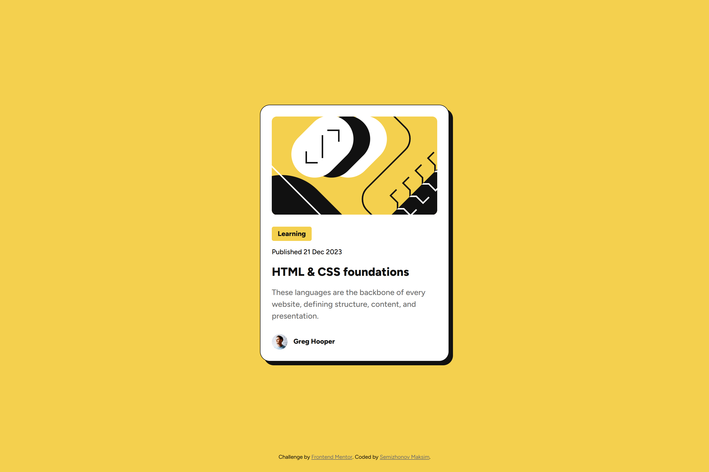
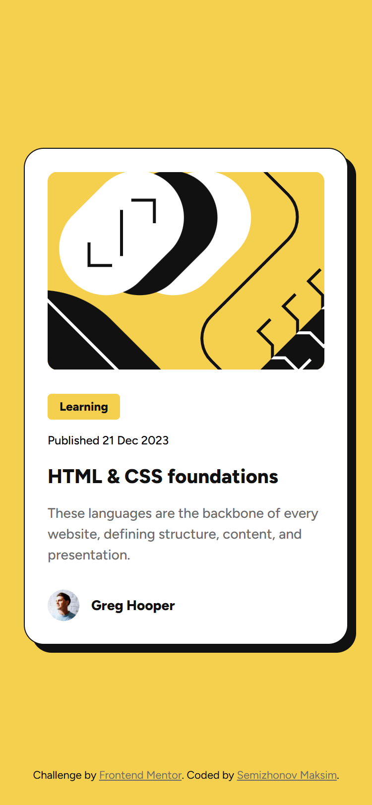

# Frontend Mentor - Blog preview card solution
This is a solution to the [Blog preview card challenge on Frontend Mentor](https://www.frontendmentor.io/challenges/blog-preview-card-ckPaj01IcS). 
## Table of contents
- [Overview](#overview)
  - [The challenge](#the-challenge)
  - [Screenshot](#screenshot)
  - [Links](#links)
- [My process](#my-process)
  - [Built with](#built-with)
  - [What I learned](#what-i-learned)
  - [Continued development](#continued-development)
- [Author](#author)
## Overview
### The challenge
Users should be able to:
- View the optimal layout depending on their device's screen size
- See hover states for interactive elements
### Screenshot
| Mobile | Desktop |
|----------------|------------------|
|  |  |
### Links
- Solution URL: [GitHub Repository](https://github.com/incmoga/blog-preview-card)
- Live Site URL: [Live Demo](https://incmoga.github.io/blog-preview-card/)
## My process
### Built with
- Semantic HTML5 markup
- CSS custom properties
- Flexbox
- Mobile-first workflow
- Responsive design
- CSS transitions for hover effects
- Variable fonts
### What I learned
This project challenged me in several interesting ways:
1. **Image adaptation challenges**:
```css
/* Solution for image cropping */
.card__image-container {
    position: relative;
    border-radius: 10px;
    overflow: hidden;
}
```
The main difficulty was adapting the image for the mobile version - it wasn't supposed to change proportions but required cropping on both sides. This misled me at first, and I didn't immediately understand why the dimensions didn't match the layout.

2. **Border-box peculiarity**:
```css
/* Accounting for border in the element's total width */
.card {
  padding: 23px; /* 23px + 1px border = 24px */
  border: 1px solid var(--color-gray-900);
}
```
I discovered an interesting feature: when an element has both a border and padding, their values are added together, affecting the internal dimensions of the element. This required adjusting the padding.

3. **Connecting variable fonts**:
```css
/* Working with variable fonts */
@font-face {
  font-family: 'Figtree';
  src: url(assets/fonts/Figtree-VariableFont_wght.ttf) format('truetype');
  font-weight: 300 900;
  font-display: swap;
}
```
This was my first time working with variable fonts, which allow using a single font file for all weights.

4. **Interactive elements**:
```css
/* Smooth hover effects */
.card {
  transition: transform 0.3s ease-in-out, box-shadow 0.3s ease-in-out;
}
.card:hover {
  transform: translate(-3px, -3px);
  box-shadow: 0.6rem 0.6rem 0 var(--color-gray-900);
}
```
I added interactivity to the card with smooth transitions and transformations on hover.
### Continued development
In future projects, I want to explore in depth:
- CSS `clamp()` function for smoother responsiveness
- CSS Grid for complex layouts
- Animation performance optimization
- Interface accessibility
- Working with CSS preprocessors
## Author
- GitHub - [Maksim Semizhonov](https://github.com/incmoga)
- Frontend Mentor - [@incmoga](https://www.frontendmentor.io/profile/incmoga)
